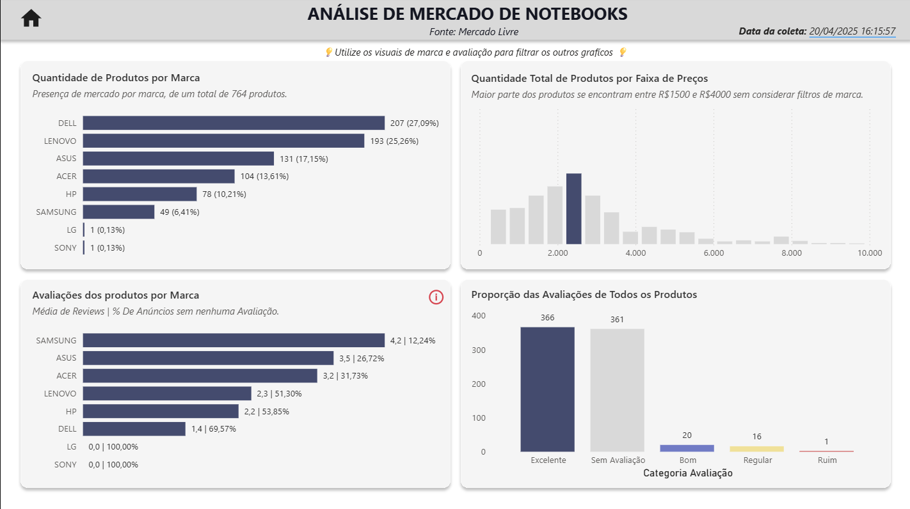

# Projeto ETL - Coleta e Análise de Dados de Notebooks no Mercado Livre

## Descrição

Este projeto implementa um pipeline ETL (Extract, Transform, Load) ponta a ponta, projetado para coletar dados de anúncios de notebooks do Mercado Livre Brasil, realizar transformações para enriquecimento e análise, e carregar os dados processados em um banco de dados SQL Server. O objetivo é criar um dataset que permita o monitoramento de preços, avaliações, descontos e a presença de marcas na plataforma, servindo como base para análises e visualizações (Nesse caso, no Power BI).

Este repositório demonstra práticas de web scraping, manipulação de dados com Pandas, interação segura com banco de dados relacional usando pyodbc, gerenciamento de configuração e versionamento com Git.

## Funcionalidades Principais

* **Extração (Extract):** Coleta automatizada de dados de anúncios de notebooks via [Scrapy](https://scrapy.org/), extraindo informações como:
    * Marca (`brand`)
    * Nome/Título (`name`)
    * Avaliação Média (`reviews_rating`)
    * Contagem de Avaliações (`reviews_count`)
    * Preço Antigo (`old_price`)
    * Preço Novo (`new_price`)
    * Fonte (`source`)
    * Data/Hora da Coleta (`created_at`)
    * *Persistência inicial dos dados brutos em formato JSON.*
* **Transformação (Transform):** Processamento e enriquecimento dos dados utilizando [Pandas](https://pandas.pydata.org/) e [NumPy](https://numpy.org/):
    * Criação de Categoria de Avaliação (`rating_category` - ex: 'Excelente', 'Bom', 'Regular') usando `numpy.select` baseado em faixas de `reviews_rating`.
    * Criação de Categoria de Volume de Reviews (`reviews_count_category` - ex: 'Contagem Alta', 'Média', 'Baixa') usando `numpy.select` baseado no tamanho da `amostra` a partir de conceitos estatísticos de significância de amostra.
    * Tratamento de tipos de dados e valores ausentes (`NaN`/`NA` convertidos para `None`) para compatibilidade com SQL Server.
* **Carga (Load):** Carregamento dos dados transformados em um banco de dados SQL Server:
    * Conexão segura utilizando `pyodbc` e gerenciamento de credenciais via arquivo `.env` e `python-dotenv`.
    * Criação idempotente da tabela de destino (`CREATE TABLE IF NOT EXISTS` via checagem `OBJECT_ID`) com esquema definido.
    * Inserção eficiente em lote usando `cursor.executemany()`.
    * Controle explícito de transações (`conn.commit()`).
* **(Opcional) Visualização:** Disponibilização dos dados para análise em ferramentas como Power BI

## Arquitetura e Fluxo de Dados

O projeto segue um fluxo ETL padrão:

1.  **Fonte:** Páginas de resultados de busca no site Mercado Livre Brasil.
2.  **Extração:** O script `notebook.py` (utilizando Scrapy) navega pelo site, coleta os dados brutos dos anúncios de notebooks e salva-os em arquivos JSON na pasta `data/`. *Justificativa: Salvar em JSON primeiro desacopla a extração (que pode falhar devido a bloqueios ou mudanças no site) das etapas seguintes.*
3.  **Transformação:** O script `main.py` lê os arquivos JSON, carrega os dados em um DataFrame Pandas, realiza a limpeza, calcula as novas colunas (`discount`, categorias, etc.) e prepara os dados no formato final. *Justificativa: Pandas oferece grande flexibilidade e poder para manipulação e análise de dados tabulares.*
4.  **Carga:** O script conecta-se ao SQL Server usando `pyodbc` e `python-dotenv` para as credenciais. Ele garante que a tabela de destino exista (criando-a na primeira execução) e então insere os dados transformados do DataFrame em lote (`executemany`). *Justificativa: SQL Server provê armazenamento relacional robusto.
5.  **Análise (Externa):** Ferramentas como Power BI podem se conectar diretamente à tabela SQL Server para criar visuais interativos e personalizados.

## Tecnologias Utilizadas

* **Linguagem:** Python 3.13
* **Web Scraping:** Scrapy
* **Manipulação de Dados:** Pandas, NumPy
* **Banco de Dados:** Microsoft SQL Server
* **Conexão BD Python:** pyodbc
* **Gerenciamento de Configuração:** python-dotenv (`.env`)
* **Controle de Versão:** Git, GitHub
* **Visualização:** Power BI

## Desafios Enfrentados e Soluções

Este projeto apresentou oportunidades valiosas de aprendizado através da resolução de desafios técnicos comuns em ETL:

* **Desafio:** Lidar com **erros de conexão SSL (08001)** ao conectar ao SQL Server local com `pyodbc` e drivers recentes.
    * **Solução:** Diagnosticado como um problema de certificado autoassinado não confiável pelo cliente. Resolvido adicionando o parâmetro `Encrypt='no'` à string de conexão para o ambiente de desenvolvimento, ciente das implicações de segurança em redes não confiáveis. *(Ou `TrustServerCertificate='yes'` se foi o caso)*.
* **Desafio:** Assegurar o **gerenciamento seguro das credenciais** do banco de dados ao compartilhar o código no GitHub.
    * **Solução:** Implementado o uso de arquivo `.env` para armazenar as credenciais localmente, carregando-as no script via `python-dotenv`. O arquivo `.env` foi adicionado ao `.gitignore` para prevenir commits acidentais. Um arquivo `.env.example` foi criado como template.
* **Desafio:** Tornar o script de carga **re-executável** sem falhar ao tentar criar uma tabela já existente.
    * **Solução:** Implementada uma verificação prévia usando `SELECT OBJECT_ID(...)` para executar o `CREATE TABLE` somente se a tabela não for encontrada.
* **Desafio:** Inserir eficientemente um **grande volume de dados** do DataFrame no SQL Server.
    * **Solução:** Utilizado o método `cursor.executemany()` em vez de loops com `cursor.execute()`, preparando os dados como uma lista de tuplas para otimização da inserção em lote.
* **Desafio:** Garantir a **compatibilidade de tipos de dados e tratamento de nulos** entre Pandas e SQL Server.
    * **Solução:** Realizada a conversão explícita de valores ausentes (`NaN`, `pd.NA`) do Pandas para `None` usando `.astype(object).replace()` antes da inserção, garantindo o mapeamento correto para `NULL` no SQL. Tipos de dados SQL foram definidos cuidadosamente no `CREATE TABLE`.

## Overview das Análises e Conclusões

Após os dados terem sido coletados, e armazenados no banco, é hora de montar as análises que dirão para o negócio como sua marca está representada nesse determinado e-commerce!

Para acessar o painel e navegar / filtrar entre os visuais: [Painel](https://app.powerbi.com/view?r=eyJrIjoiMzFiOTA2MmMtZjg1Ny00Y2VjLTk1MDUtYmJkY2YyZWFjMGQ2IiwidCI6ImIzYWUzNDliLThjZTktNDc2Yi05ZWJlLTY1Y2NhNzdlZDA4ZiJ9&pageName=ac0a8d6657b5358d32a5)

Do total de 764 produtos, 27% representam a marca dell, ou seja, dentro do mercado livre especificamente, temos que a maior parte dos anúncios são da marca, deixando ela mais presente. Esse fato pode contribuir na escolha final do consumidor, visto que se ele já não tiver uma marca em mente, a probabilidade de ele escolher a marca é de 27% (maior do que as outras).

Filtrando a marca DELL no primeiro visual, é possível identificar que boa parte dos anúncios da marca não possuem uma avaliação (69%). O que impacta e muito na confiabilidade do anunciante, mas não necessariamente do produto, ainda assim afetará a decisão da compra do produto.

Essa marca em sí se econtra posicionada com maior parte dos produtos estando entre 1500 e 3500 reais, provavelmente notebooks custo benefício, o que faz sentido, pois é onde normalmente o público geral fará sua escolha baseado em um uso não exigente.

### Próximos passos

Após essa análise inicial, algumas perguntas foram respondidas, mas outras foram criadas, exigindo uma investigação mais profunda, como:

* Quais são os fatores que levam a um produto não ter nenhuma avaliação (quase 70% no caso da DELL)? Pode ser o tempo de listagem, a popularidade do produto, a plataforma de venda, etc.

* Como a distribuição de preços dos produtos DELL se compara com a distribuição de preços de outras marcas, como LENOVO ou ASUS, que têm uma quantidade similar de produtos? A análise atual só mostra a distribuição da DELL.

* O alto percentual de anúncios sem avaliação para a DELL é comum no mercado, ou é algo específico dessa marca ou desse conjunto de dados? Comparar esse percentual com o de outras marcas seria interessante.

   
`Esse projeto foi um exemplo prático de como uma análise exploratória pode responder perguntas pontuais, ao mesmo tempo que nos leva a raciocínios mais profundos, tentando entender a causa-efeito dos números que estamos vendo.`
    

_Overview do Painel:_
